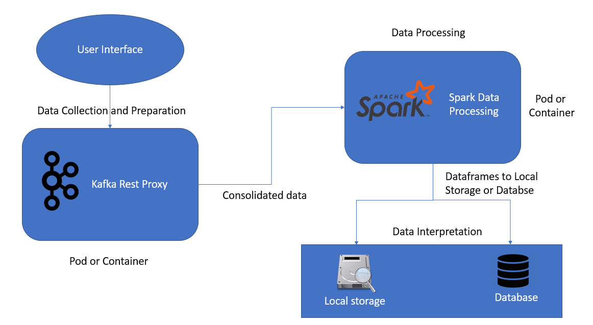

This is template for building a pipe line for the bulk and streaming data loading, processing data and merging data. 

In this pipe line we have three different phases.
1. Data collection and preparation 
2. Data processing 
3. Data interpretation

The total data flow pipe line looks as below.

# 1. Data collection and preparation
